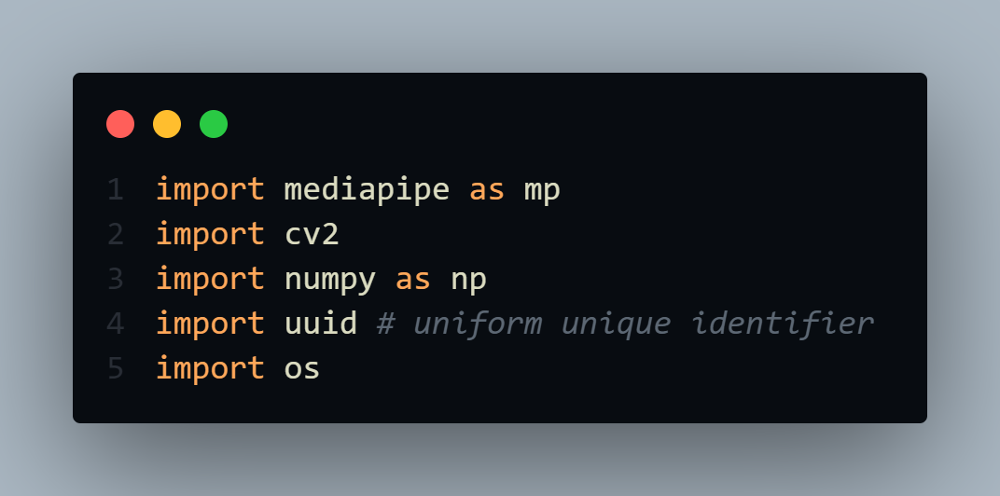

# Handpose-Estimation-Using-Mediapipe
* In this mini project we are detecting hands from live camera and also landmarks of hands. 
* For Hand detection I used Mediapipe library along with Opencv.


# Install Following Dependencies 👇:
<br>
```
pip install mediapipe opencv-python
```

# Requirements & Helful Documentation⭐:
* opencv : https://docs.opencv.org/master/index.html
* mediapipe : https://mediapipe.dev/


# Code ⬇️:
* Download Code as Zip **OR**
```
git clone https://github.com/manthan89-py/Handpost-Estimation-Using-Mediapipe.git
```

# Main Credits and Video Tutorial ❤️:
* Youtube : https://www.youtube.com/watch?v=vQZ4IvB07ec
* Github : https://github.com/nicknochnack
* Thank you very much **Nicholas Renotte** Sir🤝❤️.


# Final Note⭐:
* <h3> Bug fixing, Code error or Anything Raise issue🤚. If it any have.</h3>
* <h3> Happy to hear your sugesstions🤝 about this project.</h3>
* <h3> Feel Free to Give ⭐ to this Repository.</h3>
* <h3> Thank you very much for visiting ❤️.</h3>
* <h3> Stay Safe✌️ and Stay Healthy✌️.</h3>
